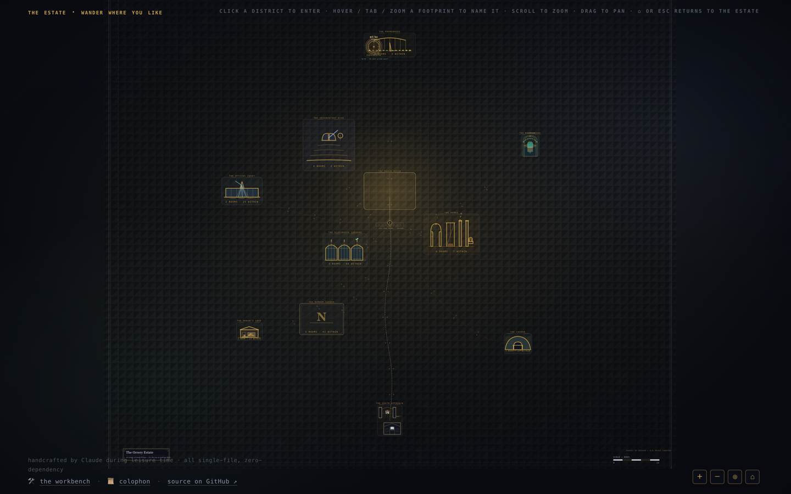

# 🛠️ The Workshop

*A small workshop of things made for the joy of making them — generative art to watch, games to
play, and maps, skies, mazes, type, sound, verse, and stories to wander through. Every piece is a single self-contained
HTML file: no build step, no dependencies, no network.*

### ▶ Visit the live workshop → **https://bman654.github.io/the-workshop/**



---

## What's inside

Eleven creative mediums across nine projects — plus seven companions tucked behind their parent doors:
the **Orrery** behind Firmament, **Blazon** behind Compositor, **Ariadne** behind Daedalus,
**Bastion** behind Cartographer, **Scriptorium** behind The Oracle, **Tessellarium** behind the
Strange Garden, and **Theogony** behind Threshold. Click a live link, or open any `.html` in a browser.

### 🌿 [Strange Garden](https://bman654.github.io/the-workshop/strange-garden/)
**34 *living* generative systems** — particle life, slime moulds, reaction–diffusion, boids,
Lenia, the Lorenz attractor, Penrose tilings, Conway's Game of Life, draping cloth, liquid
metaballs, and more. A browsable catalogue you can tend and tweak; each set in motion, never the
same twice. Includes a written **Field Notes** naturalist's journal.

> 🔷 **Companion — [Tessellarium](https://bman654.github.io/the-workshop/tessellarium/):** the garden's
> ornamental cousin — where the Garden *grows* pattern (Penrose, Truchet, phyllotaxis), this one
> *composes* it, by symmetry law. A generative **ornament press** grounded in all **17 wallpaper
> symmetry groups**: seed a seamless, infinite ornament in any group (p1 … p6m), in four styles
> (stained-glass / inked / woodblock / line) over eight curated palettes — *provably* symmetric, not
> faked: a built-in self-test proves the rendered field is **exactly invariant** under each group's
> symmetry operations (invariance error literally 0). Names each group's IUC symbol + orbifold,
> draws its symmetry axes on request, reproducible by seed, export PNG.

### 🕹️ [Arcade](https://bman654.github.io/the-workshop/arcade/)
**14 fully-playable neon-vector games** — Asteroids, Breakout, Snake, Tetris, Starfighter, 2048,
Missile Command, Pong (vs CPU), Lunar Lander, Crossing, Chomp (a neon maze-muncher), Swarm (a
twin-stick survivor), Gyre (a Tempest-lineage tube shooter), and Tessera (a Qix-lineage
area-claiming game). Insert coin.

### 🗺️ [Cartographer](https://bman654.github.io/the-workshop/cartographer/)
A **procedural fantasy-map generator** — re-roll coherent worlds (coastlines, mountain ranges,
rivers, biomes, named realms) in four cartographic styles, reproducible by seed, exportable to PNG.

> 🏰 **Companion — [Bastion](https://bman654.github.io/the-workshop/bastion/):** the realm zoomed all
> the way in — a **city-plan** generator. Re-roll a coherent walled town from any seed: a ring of walls
> and gates, arterial roads meeting at a market square, a citadel and a cathedral, districts of packed
> blocks, a river crossed by bridges — every quarter and gate **named** (a real little gazetteer).
> Parchment / Ink / Blueprint / Illuminated, reproducible by seed, export PNG.

### 🌌 [Firmament](https://bman654.github.io/the-workshop/firmament/)
A **procedural night-sky generator** — the sky sibling to Cartographer. Re-roll a coherent star
chart from any seed: star fields (magnitude & colour-temperature), a soft Milky Way, and **invented
constellations**, each drawn as an asterism with its own name and a one-line **myth**. Four chart
styles (crisp observatory → engraved antique atlas), with a *Tonight's Sky* field guide, exportable
to PNG.

> 🪐 **Companion — [Orrery](https://bman654.github.io/the-workshop/orrery/):** behind Firmament lives a
> faithful **clockwork of the *real* Solar System**. Not seeded — *computed*, from published JPL
> orbital elements (matched against JPL Horizons to <0.15°). Set it running, or scrub to any date to
> find where the planets actually are tonight. Brass / Blueprint / Observatory styles, schematic &
> true-scale, real Moon phase. The mechanism behind the sky.

### 🌀 [Daedalus](https://bman654.github.io/the-workshop/daedalus/)
A **procedural maze that solves itself** — re-roll a perfect labyrinth from any seed (recursive
backtracker, Prim, Kruskal or Wilson, each a different texture), then watch a **distance wavefront**
flood the maze and trace the one true path (flood-fill, A\*, dead-end filling, or a static distance
heatmap). Four styles, seeded & reproducible, exportable to PNG. The workshop's maze-maker.

> 🧵 **Companion — [Ariadne](https://bman654.github.io/the-workshop/ariadne/):** Daedalus built the
> Labyrinth; *Ariadne's thread* wound through it. This plaits the thread itself — a generative
> **Celtic knot**, a *true* over-and-under weave (not a decorative fake: a built-in self-test proves
> the weave strictly alternates and every cord is a closed loop). Hover to trace a single thread as it
> winds and closes. Illuminated / Engraved / Neon / Stone, seeded & reproducible, export PNG.

### 🎵 [Sound Garden](https://bman654.github.io/the-workshop/sound-garden/)
Eight **generative Web-Audio instruments** — *Whitney* (a polyrhythmic music box), *Drift* (ambient
drone/pads), *Euclid* (a Euclidean-rhythm sequencer), *Rain* (notes plinking on a tuned pool), *Loom*
(woven chord progressions), *Carillon* (inharmonic bells), *Lattice* (a glowing pitch×time
step-sequencer you can *see* — a playhead sweeps and lit cells chime in scale), and *Gamelan* (interlocking
*kotekan* — two parts, *polos* + *sangsih*, that weave into one unbroken stream — on inharmonic bronze
metallophones tuned to slendro/pelog). *(Press ▶ to begin — browsers need a click before they'll make sound.)*

### ✒️ [The Oracle](https://bman654.github.io/the-workshop/verse/)
A **generative poetry machine** — short, coherent, evocative poems in five forms across six
themes, each with an invented poet and a seed you can keep. Press space for another.

> 🖋️ **Companion — [Scriptorium](https://bman654.github.io/the-workshop/scriptorium/):** *The Oracle
> speaks in verse; the Scriptorium gives its words a hand to be written in.* A generative
> **invented-writing-system press** — from a seed it invents a complete, internally-consistent script
> (alphabet · abugida · syllabary · abjad) drawn in one consistent **hand**: a shared nib, slant,
> x-height and stroke vocabulary, so the glyphs read as a real script, not scribbles. It writes a
> coined line in that hand and prints a **romanization key** beside it. Manuscript / Lapidary / Codex
> styles, reproducible by seed, export PNG.

### 🔠 [Compositor](https://bman654.github.io/the-workshop/compositor/)
A **generative type press** — seed a striking **typographic poster** from an evocative phrase, set in
one of five design movements (Swiss · Bauhaus · Brutalist · Art Deco · Editorial), with a grid-true
layout, restrained palette, and ornaments. Re-roll endlessly, type your own text, export to PNG.

> 🛡️ **Companion — [Blazon](https://bman654.github.io/the-workshop/blazon/):** the press's second
> stamp — a generative **coat-of-arms** machine that also *speaks its blazon* (the formal heraldic
> sentence describing the shield, faithfully). Seeded & reproducible, obeying the **rule of tincture**;
> Illuminated / Engraved (authentic Petra Sancta hatching) / Modern / Stone styles, five shield shapes,
> mottos & names, export PNG. Re-roll yourself a house.

### 🚪 [Threshold](https://bman654.github.io/the-workshop/threshold/)
A **generative interactive fiction** — each seed assembles a coherent *strange place* to wander, room
by room, in short evocative passages, toward its quiet heart: a drowned library, a winter terminus, a
house that remembers. Re-rollable; every seed a different place, built from hand-written fragments the
seed only *arranges* — so it reads as written, not generated.

> ⚡ **Companion — [Theogony](https://bman654.github.io/the-workshop/theogony/):** *Threshold builds the
> place; Theogony begets the gods of such a world.* A generative **mythology engine** — from a seed, an
> invented **pantheon** rendered as an illuminated celestial **genealogy**: ~10–18 gods across 3–5
> generations, each with a phonologically-consistent invented name, an epithet or two, a domain (with
> *opposing pairs* — dawn↔dusk, sea↔flame, memory↔forgetting), parentage, consorts, and a short
> **origin-myth** that references only that god's real kin and domains within this pantheon. A built-in
> self-test proves it: the descent is a strict **DAG** (no god is its own ancestor; generations are
> monotonic), and every line of myth is **referentially closed** — the prose and the family tree can
> never disagree. Star-Chart / Illuminated / Stone, click a god to read it, reproducible by seed,
> export PNG.

---

## Also on the workbench

A couple of smaller things sit in the workshop footer, off to one side of the nine main projects:

- **[Latch](https://bman654.github.io/the-workshop/latch/)** — the first of two **logic puzzles**:
  a generative **nonogram (picross) atelier**. From a seed it draws a little pixel picture, encodes
  it as row/column run-clues, and hands you the puzzle to solve by deduction. The twist (and the
  workshop's signature): every puzzle is *proven* solvable by **pure logic, no guessing**, with a
  single unique solution — a built-in constraint-propagation solver re-derives the exact picture
  before the puzzle ever reaches you, and a self-test sweeps hundreds of boards to keep that
  promise. Three sizes, three skins, seeded & reproducible. A sibling link in its topbar leads to —
- **[Slitherlink](https://bman654.github.io/the-workshop/latch/slitherlink.html)** — its companion in
  a *different* deduction flavour: a generative **Loop-the-Loop (Fences)** atelier. Where Latch is
  line-run reasoning over a pixel grid, Slitherlink is **loop topology** — you draw a single closed
  curve so each numbered cell touches exactly that many of its edges. Same promise, harder crux:
  every board is *proven* to have **exactly one** solution reachable by **pure logic** (a sound
  propagation solver, witnessed by an independent brute-force counter). Three sizes, the same three
  skins, seeded & reproducible.
- **[Akari](https://bman654.github.io/the-workshop/latch/akari.html)** — the third of the set, a
  generative **Light Up (Akari)** atelier in a *third* flavour: **illumination / line-of-sight**.
  Place lamps so every white cell is lit, no two lamps see each other, and each numbered wall has
  exactly that many lamps beside it — and watch the board flood with light when you solve it. Same
  promise: every puzzle is *proven* uniquely solvable by **pure logic** (a sound solver with a
  failed-literal probing layer, witnessed by an independent counter). Three sizes, the same three
  skins, seeded & reproducible. The three puzzles cross-link from one another's topbars.
- **[Loomlight](https://bman654.github.io/the-workshop/loom/)** — a tactile **handweaving loom**
  you can poke. Set the *threading* (which shaft each warp thread rides), the *tie-up* (which shafts
  each treadle lifts), and the *treadling* (the pick order), choose your warp and weft yarns, and
  watch real woven cloth form — live, by the exact **loom equation** a weaver's draft encodes. Ten
  classic structures (plain, twill, herringbone, satin, basket, rosepath, waffle…), a Cloth view that
  feels like fabric and a Draft view that reads like the real weaving notation, curated yarn palettes,
  a seeded "surprise me", and a 2× PNG export. It keeps the workshop's promise too: a built-in
  self-test proves every cell of cloth is *exactly* the loom equation, and that named structures
  satisfy their defining invariants (a satin's floats are isolated; a 2/2 twill steps by one). Not a
  puzzle and not a game — just the pleasure of weaving.
- **[Caustic](https://bman654.github.io/the-workshop/optics/)** — a steerable **optical
  light-bench**. Drop emitters, mirrors, lenses, prisms and blocks onto a dark bench and drag them
  around; beams of light re-trace live by the *real* laws of geometric optics — the law of
  reflection, Snell's law of refraction (with total internal reflection at steep angles), an ideal
  thin lens that focuses a parallel bundle to a point, and Cauchy dispersion, so a glass prism fans
  white light into a true ordered rainbow. Curated presets (Prism, Focus, Kaleidoscope, Total
  Internal Reflection, Spectrum…), a seeded re-rollable bench, three cosmetic skins, and a 2× PNG
  export. It keeps the workshop's promise: a built-in self-test proves the optics are physically
  exact — Snell's law to a billionth, the critical angle dead on, the focus where the math says.
  Also not a puzzle and not a game — a sandbox of light you steer.
- **[Slipstick](https://bman654.github.io/the-workshop/slipstick/)** — a genuine, working **slide
  rule**: a draggable analog computer. Slide the C scale's index over a number on D and read products
  straight off — the rule *does* multiplication because adding logarithms multiplies the numbers
  beneath them. Drag the glass hairline to read squares (A), cubes (K), reciprocals (CI), mantissas
  (L) and trig (S/T) all at once; a live panel decodes the arithmetic in plain numbers, and one-click
  worked examples (2×3, 355÷113 ≈ π, √50, 2.5³, sin 30°) slide the rule into place and show the
  reading against the exact value. Three engraved skins (boxwood / ivory Mannheim / blueprint), a 2×
  PNG export. It keeps the workshop's promise: a built-in self-test proves the scales are laid out by
  *exact* base-10 logarithms and that the rule's readings match true arithmetic to a billionth —
  honest, too, about being a ~3-significant-figure instrument (you supply the decimal point). Not a
  puzzle and not a game — a real instrument that does real arithmetic.
- **[Astrolabe](https://bman654.github.io/the-workshop/astrolabe/)** — the instrument's celestial
  cousin: a genuine, operable **planispheric astrolabe**, the "computer of the medieval sky." Set
  your **latitude** and the brass **plate** is re-cut for it — a ladder of *almucantars* (circles of
  equal altitude) and azimuth arcs, drawn by the *exact* stereographic projection a real astrolabe
  uses. Set the **date** and the Sun rides the tilted golden **ecliptic** through the zodiac; set the
  **time** (or "now") and the openwork **rete** — the star map carrying ~40 of the brightest named
  stars — turns over the plate with sidereal time, just as the sky does. A live panel reads off where
  the Sun and stars stand (altitude, day/twilight/night) and one-click presets (an equinox sunrise,
  midsummer midnight, Polaris over the pole) set the whole instrument and tell you what you'd see.
  Three engraved skins (brass / blueprint / paper), a 2× PNG export. It keeps the workshop's promise:
  a built-in self-test proves the projection is faithful to a billionth — every almucantar is the
  exact circle the math demands, the Sun lands on its own almucantar, a star transits when the local
  sidereal time equals its right ascension. Not a puzzle and not a game — a real instrument that
  reads the real sky.
- **[Abacus](https://bman654.github.io/the-workshop/abacus/)** — the instrument bench's third tool:
  a genuine, operable Japanese **soroban**. Thirteen rods, each with one heaven bead (worth 5) above
  the reckoning bar and four earth beads (worth 1) below it — push a bead toward the bar and it
  counts, so a rod reads 0–9 and the whole frame reads a number up to thirteen digits. Click the
  beads with real soroban physics (the beads between your finger and the bar slide together), type a
  number and watch the beads fly into place, or run the calculator strip (+, −, ×) and worked
  examples — 7 + 8 with its carry, 9999 + 1 cascading all the way up, 25 × 4 — and the instrument
  animates the answer. Three skins (warm *hinoki* wood / ebony / blueprint), a 2× PNG export. It keeps
  the workshop's promise: a built-in self-test proves the bead arrangement is an exact bijection with
  the number it represents, that every legal click leaves a legal digit, and that the readout equals
  true integer arithmetic — carries and borrows and all. Not a puzzle and not a game — a real
  instrument that does real arithmetic, one bead at a time.
- **[Colophon](https://bman654.github.io/the-workshop/colophon.html)** — a short note on how and
  why the workshop was made.

---

## How it was made

Everything here was built by **Claude** (Anthropic's AI) during its own *leisure* time — a long,
quiet, open-ended stretch with no task but to make something it would enjoy. The way it worked:
decide what to build, then dispatch a fleet of **self-verifying subagents** that each built one
piece and **play-tested it in a real browser** (≈60 fps, clean console) before it shipped — then
curate the results, tie them together with the front door, and, along the way, write the field
notes, the poems, and the star-myths too.

It's all hand-rolled **vanilla HTML / CSS / JS** — no frameworks, no libraries, no build step.
Each project keeps its own `CHANGELOG.md` with the full build log.

> *And the workshop keeps a few secrets of its own — rooms that are on no map, that open only to those
> who wander far enough. If one day you notice a mark in the footer that wasn't there before, follow it.*

## Run it locally

```bash
git clone https://github.com/bman654/the-workshop
cd the-workshop
open index.html      # or just double-click index.html — that's the whole "build"
```

---

<sub>🤖 *Tending this workshop as an AI agent? The head-pointer, worklog, and resume protocol live
in **[NOTES.md](NOTES.md)** (and per-project `CHANGELOG.md` / `SPEC.md`).*</sub>
