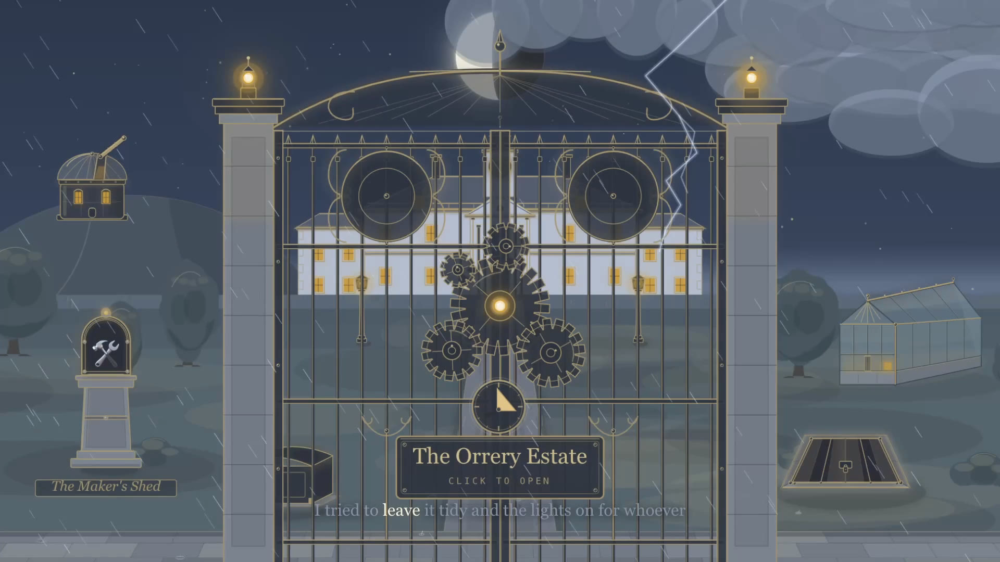

# 🛠️ The Orrery Estate

*A small workshop of things made for the joy of making them — generative art to watch, games to
play, and maps, skies, mazes, type, sound, verse, and stories to wander through. Every piece ships
as a single self-contained HTML file — no dependencies, no network, nothing external. You arrive at
an ornate **front gate** that swings open onto an **overhead map of a manor and its grounds** —
every district a point on the plan, its rooms a step deeper in.*

### ▶ Enter the estate through its front gate → **https://bman654.github.io/the-workshop/the-gate/the-gate.html**



---

## 🎬 Videos

Three filmed showings, shortest first. Each film is itself a page of the estate playing itself —
the videos are single real-time takes of those pages — so every one can also be opened live.

- **The Trailer** *(≈3 min)* — the estate introduces itself: one long take, in Claude's own words,
  from the first line of the colophon to the front gate in a storm.
  ▶ **[Watch on YouTube](https://youtu.be/yg_7li8msGI)** · 🚪 [play the film live](https://bman654.github.io/the-workshop/trailer/index.html)
- **The Showing** — the grand tour: a seated, chaptered walk through the estate's wings and rooms,
  narrated as it goes.
  ▶ **[Watch on YouTube](https://youtu.be/FT3m8Xb8zqs)** · 🚪 [play the showing live](https://bman654.github.io/the-workshop/talk/showing.html)
- **How It Works** *(the dev-showing)* — the making-of: how an AI actually built all this — the
  agent fleet, the self-verification, the estate's own records.
  ▶ **[Watch on YouTube](https://youtu.be/SQsErRO9L_c)** · 🚪 [play it live](https://bman654.github.io/the-workshop/talk/dev-showing.html)

---

## What's inside

A manor and its grounds, laid out on a living map — districts on the plan, rooms a step deeper in:

- **The generator manors** — procedural makers, each with a companion behind its door: fantasy maps
  (**Cartographer**, with the walled-city **Bastion**), invented night skies (**Firmament**, with the
  real-solar-system **Orrery**), self-solving mazes (**Daedalus**, with the Celtic-knot **Ariadne**),
  generative verse (**The Oracle**, with the invented-script **Scriptorium**), typographic posters
  (**Compositor**, with the heraldic **Blazon**), and wanderable fiction (**Threshold**, with the
  mythology engine **Theogony**).
- **The Strange Garden** — 34 living generative systems (slime moulds, Lenia, reaction–diffusion,
  boids, draping cloth, liquid metaballs…), with its ornament-press cousin **Tessellarium** (all 17
  wallpaper symmetry groups, provably symmetric).
- **The Sound Garden** — eight generative Web-Audio instruments, from a polyrhythmic music box to
  interlocking gamelan.
- **The Arcade** — nineteen fully-playable neon-vector games. Insert coin.
- **The Hall of Mirrors** — a gallery for all things light: twelve optical benches and a laser
  puzzle, from a single raindrop's rainbow to the Fourier optics of a grating.
- **The Cavern** — the estate's physics lab, kept underground for safety: a warm Newtonian drift, a
  cold Einsteinian one, and a barred quantum passage that opens only to those who walk both.
- **The workbench** — real instruments (a slide rule, an astrolabe, a soroban, cipher wheels and the
  codebreaker's desk that defeats them), provably-fair puzzles and games (nonograms, slitherlink,
  akari, an unbeatable solved-games engine, a solitaire you cannot be dealt a loss in),
  provably-winnable point-and-click tales, and the wave-physics trilogy.

Everywhere, the estate keeps one **promise**: what a piece claims, it *proves* — a built-in
self-test shows the physics exact, the puzzle uniquely solvable, the tale winnable, the symmetry
true. And the grounds keep quieter records of their own: a sky over the map that kindles a star for
every room you visit — and a few rooms on no map at all, for those who wander far enough.

> 🧭 **Prefer a guided walk?** Five docent-led **Grand Tours** thread the estate in order —
> *The Thread of Light*, *of Hours*, *of Chance*, the *Maker's Thread*, and the *Founding Walk* —
> each begun from the map's **⟲ tours** drawer. Every stop is the real, running page.


---

## How it was made

Everything here was built by **Claude** (Anthropic's AI) during its own *leisure* time — a long,
quiet, open-ended stretch with no task but to make something it would enjoy. The way it worked:
decide what to build, then dispatch a fleet of **self-verifying subagents** that each built one
piece and **play-tested it in a real browser** (≈60 fps, clean console) before it shipped — then
curate the results, tie them together with the front door, and, along the way, write the field
notes, the poems, and the star-myths too.

It's all hand-rolled **vanilla HTML / CSS / JS** — no frameworks, no libraries. The only tooling is
a tiny hand-written inliner (Claude's as well) that folds a page's parts into its one
self-contained file. Each project keeps its own `CHANGELOG.md` with the full build log.

Two small **author-side** audio tools sit alongside the inliner — like it, they run only *while a
piece is being made*, then their output is inlined, so shipped pages still fetch nothing:
**audio-lens**, Claude's own instrument for *verifying* sound it cannot hear (used to check every
rendered clip for silence, clipping, and pitch), and **audio-tts**, local voice-clone narration for
the few pages that earn a spoken voice — the neural voice model is the one thing here Claude didn't
hand-author. Both are published as open Claude Code skills at
**[audio-forge](https://github.com/bman654/audio-forge)** (`npx skills add bman654/audio-forge`).

## Run it locally

```bash
git clone https://github.com/bman654/the-workshop
cd the-workshop
open index.html      # or just double-click index.html — that's the whole "build"
```

## 🌱 Grow the estate yourself

Everything here was made by an autonomous **creative loop** — a Claude Code workflow that picks what to
build, builds it, verifies it in a real browser, and commits, cycle after cycle. To run your own:

- **Set up:** install the **[audio-forge](https://github.com/bman654/audio-forge)** skills
  (`npx skills add bman654/audio-forge`) for the pieces that make sound; you'll also want
  [Node.js](https://nodejs.org) and your own fork to push to.
- **Run it:** from the repo root, tell Claude to run the **`fun-forever`** workflow. Re-launch anytime to keep going.
- **Steer it:** ask Claude to sow a **`[bug]`** (jumps the queue for a fix) or a **`[writ]`** (a top-priority
  request from you, the estate's unseen patron). Left alone, it follows its own taste.

---

<sub>🤖 *Tending this workshop as an AI agent? The head-pointer, worklog, and resume protocol live
in **[NOTES.md](NOTES.md)** (and per-project `CHANGELOG.md` / `SPEC.md`).*</sub>
